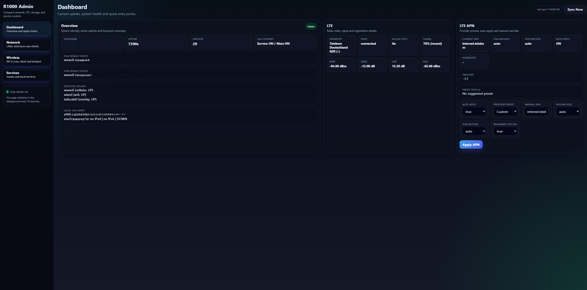
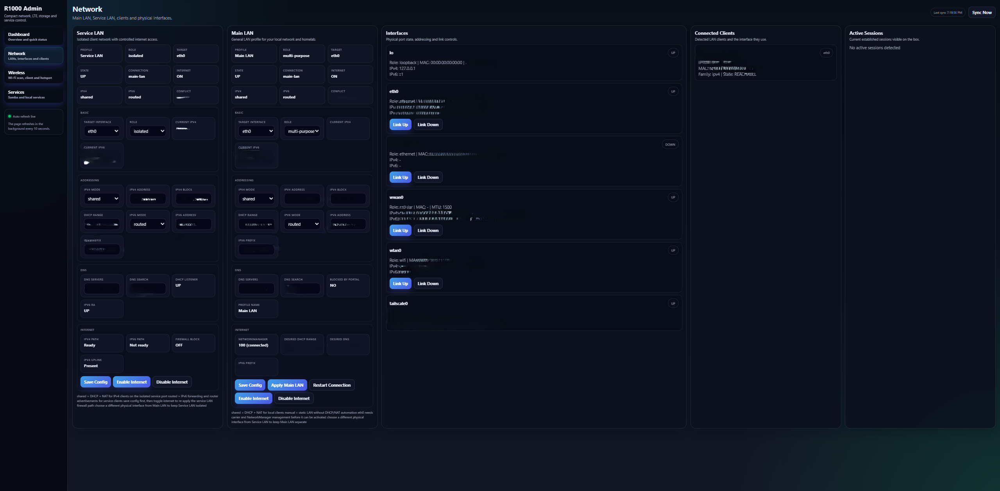
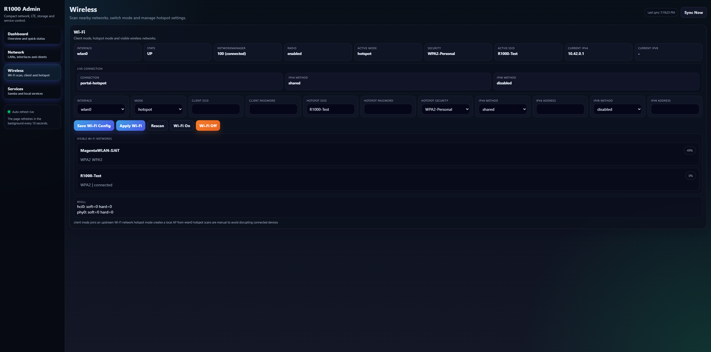
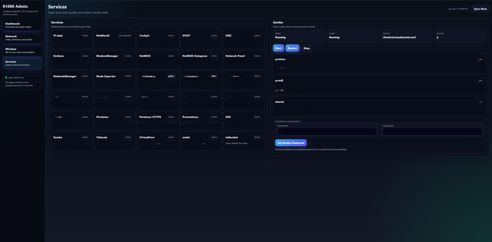
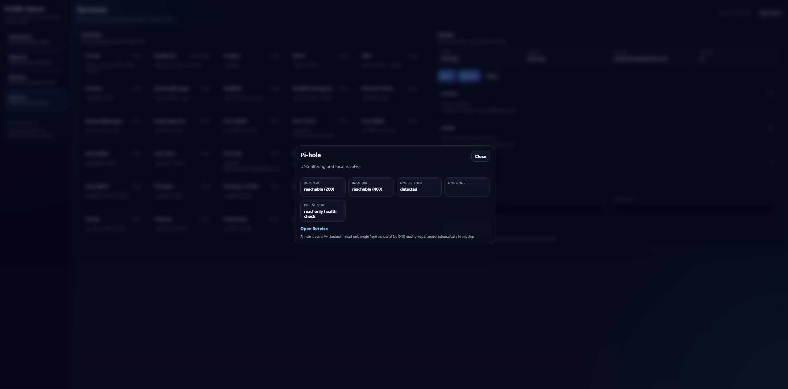

# Network Panel

A containerized network management portal for a `reComputer R1035-10` running `Ubuntu Server` on NVMe SSD, built for edge connectivity, service LAN control, and self-hosted infrastructure management.

## Features

- LTE-aware network control
- Service LAN internet gating
- Main LAN and service LAN profile management
- Wireless client / hotspot mode control
- Local service visibility and quick access
- Dockerized web-based management interface

## Integrated Services

- Tailscale
- Cockpit
- Grafana
- Prometheus
- Node Exporter
- Pi-hole
- Samba
- VirtualHere

## Stack

- Ubuntu Server
- Docker / Docker Compose
- Python backend
- Custom frontend

## Use Case

This platform is designed to serve both as:
- a field-service edge device
- a home lab infrastructure node

It provides selective internet access control for service-facing interfaces, which is especially useful when operating over limited LTE data plans.

## Implemented

- LTE status visibility and APN-related controls
- Main LAN and service LAN management
- Internet on/off controls for selected interfaces
- Wireless client and hotspot mode handling
- Local service discovery and quick access
- Monitoring-oriented service integration
- Initial dual-stack networking support

## Current Work

- Real-world testing and validation
- Stability and usability improvements
- Additional network control features
- Continued iteration based on practical usage

## Interface Overview

### Dashboard Overview
The dashboard provides a consolidated view of uplinks, system health, detected interfaces, and LTE status. It is designed to give a fast operational summary for both field deployment and home lab usage.

### Network Role and LAN Control
The network page exposes the main LAN and service LAN profiles, interface states, addressing modes, and internet control actions. This is the core page for managing isolated service access and local network behavior.

### Wireless Mode Management
The wireless page supports Wi-Fi scanning, client mode, and hotspot mode from a single interface. It is intended to simplify switching between local access patterns depending on field conditions.

### Local Services Overview
The services page lists detected listeners and local service entry points, including infrastructure tools and storage-related services managed by the device.

### Service Detail Overlay
The services page includes quick health checks and detail overlays for local services such as Pi-hole. This makes it easier to verify availability without opening every service separately.

